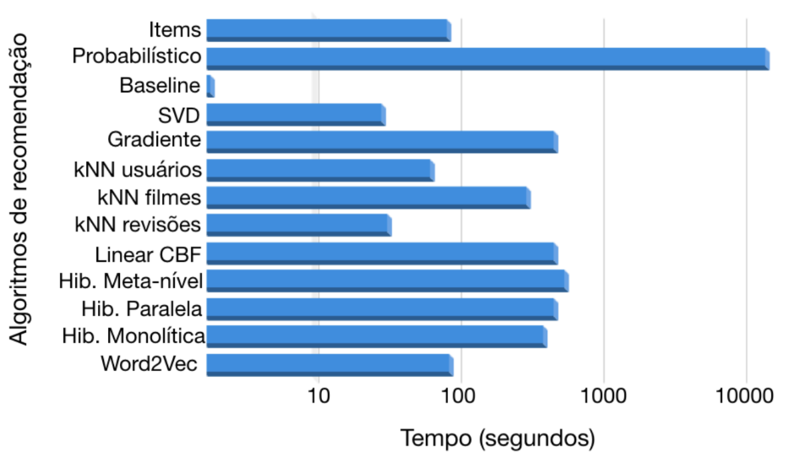
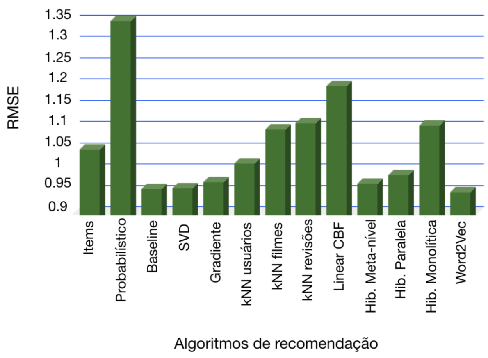

# Recommendation System
lala

[Link Kaggle](https://www.kaggle.com/competitions/scc5966-2018-2o)

## Datasets
In this work, a movie review database was used. The database consists of 3,974 users and 3,564 movies. In total, the database has 539,754 reviews, where ratings are given on a 5-star scale.

All ratings are contained in the file "train_data.csv in the following format: UserID,MovieID,Rating,Timestamp
- UserIDs range between 1 and 3974
- MovieIDs range between 1 and 3564
- Ratings are made on a 5-star scale (whole-star ratings only)
- Timestamp is represented in seconds since the epoch as returned by time(2)
- Each user has at least 20 ratings

## Methodology
In this work, I have implemented several recommendation algorithms. These algorithms are as follows:
1. Item-based collaborative filtering
2. Probabilistic method
3. Baseline method
4. Matrix Factorization SVD (Singular Value Decomposition)-based method 
5. Gradient Descent-based method
6. Nearest Neighbors-based Collaborative Filtering (kNN-based CF) using user data or movie genres or movie reviews
7. LinearCBF, a method that employs machine learning and movie genres
8. Hybrid Filtering (monolithic, parallel, or meta-level)
9. Proposed Method based on Word2Vec Model

## Main results
The evaluation of recommendation systems enables us to determine algorithm efficiency and objectively compare the performance of one system with others. For the purposes of this study, we employed the RMSE (Root Mean Squared Error) metric. Additionally, assessing the training time for each algorithm to predict user preferences proved significant. This evaluation, accounting for both time and efficiency, holds importance as certain algorithms may be swift but lack strong performance. Conversely, some algorithms may demand substantial training time yet yield excellent outcomes. In the following figures, I present the evaluation of various recommendation system methods, considering both RMSE metrics and execution time.

